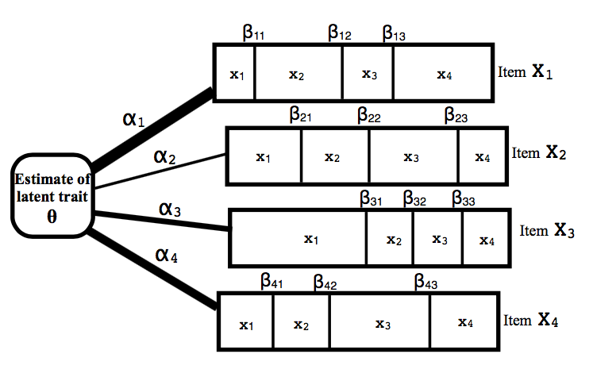

```{r setup, include=FALSE}
knitr::opts_chunk$set(echo = TRUE)
library(ltm)
library(msm)

```

### Parametric Item Response Theory: An Overview  
  
Parametric Item Response Theory (IRT) provides a framework for modeling the relationship between some latent trait, $\theta$ (which we assume comes from a known distribution), with categorized responses to a set of items. Here are some examples of situations where an IRT model could be useful:

1. You want to measure students' math ability (latent trait). You administer a math test and record whether the student answered each question (item) correctly or not.
2. You want to measure level of depressive symptomology (latent trait) for a set of patients. You administer a questionaire where patients respond to a set of statements (items) with a rating from 1-4 (where 1="never" and 4="always").

There are a variety of IRT models that use different constraints and are useful for different types of data, but the diagram and explanations below give a general format. In the diagram, the latent trait, $\theta$, is estimated using a set of four items (denoted $X_1$, $X_2$, $X_3$, and $X_4$), each with four possible response categories (denoted $x_1$, $x_2$, $x_3$, and $x_4$). The parameters of the model are the $\alpha$s and the $\beta$s:

1. Alphas: The value of $\alpha$ (visualized below as the thickness of the line connecting the latent trait to each item) estimates the relative importance (or "loading") of each item with respect to the latent trait. For example, consider the depression scale described above. Suppose the questionaire includes the following two statements (items): 1. "I feel sad" and 2. "I like the color green" among other questions aimed at measuring "depressive symptomology". In this case, answers on item 1 are probably highly related to answers on other items (and therefore highly related to patients' estimated depression level). On the other hand, the frequency with which patients report liking the color green is probably less related to the other items (i.e., less related to depressive symptoms). Therefore, we expect item 1 to have a larger $\alpha$ than item 2.

2. Betas: Each item has a set of $\beta$s, which, in tandem with the $\alpha$s, determine the probability of a respondent landing in each possible category of an item, given the value of their latent trait. For example, again consider the depression questionaire described above and suppose that a person with a "true" depression value, $\theta = 0.6$ (on a standardized normal scale) is responding to the statement "I feel sad" and giving a rating from 1-4 where 1="never" and 4="always". It is not 100% certain which category they will choose. The $\beta$ parameters determine the "spacing" between categories. In other words, $\beta_3$ for that item is the value of $\theta$ (true depression) for which respondents would be equally likely to choose a rating of "3" or a rating of "4". This spacing may vary between items: the difference between a rating of "3" and a rating of "4" might be more stark for some items than others.

```{r, out.width = "300px", fig.align="center", echo=FALSE}

```

\pagebreak  
Another way to visualize and understand the $\alpha$s and the $\beta$s is to look at item response category characteristic curves (ICCCs), which show the probability of each possible response on a particular item for all possible values of a latent trait, $\theta$. For example, consider the plots below which show ICCCs for 2 different 4-category items. We assume $\theta$ is normally distributed, so the x-axis includes values of $\theta$ between -4 and 4 (i.e., more than 99% of all possible values of theta). At each value of $\theta$, the height of each curve represents the probability that a person with that value of the latent trait would respond to the item with each respective category. Intersections between consecutive category curves are the $\beta$s: the value of $\theta$ where an individual would be equally likely to land in either category. At any value of $\theta$, the heights of the curves will add to one (since every respondent must land in one of the four categories).   
    
    
The first plot shows an item with a low $\alpha$ parameter. Note that the curves are relatively flat. If you were to draw a vertical line at some value of $\theta$ (say $\theta =1$), you would see that respondents with this value of $\theta$ have a ~20-40% chance of landing in categories 2-4. In contrast, the second plot shows an ICC curve for an item with comparatively large $\alpha$. Now, if you draw a vertical line at $\theta =1$, the probability of landing in category 1 or 2 is near zero (with a ~50% chance, each, of landing in category 3 or 4). Remember from the depression scale example above that the item "I like the color green" would probably have a low $\alpha$ value because it is not clearly related to depression. In that case, regardless of their depression level, an individual might be equally likely to rate their agreement with that item as any value from 1-4; therefore, it makes sense that the curves should be more flat, so that each category has similar probability for every value of $\theta$.

```{r, out.width = "300px", fig.align="center", echo=FALSE, message=FALSE}
require(ltm)
#Function for simulating data from a GPCM
GPCMsim <- function(thetas, betas, alphas){
  if(length(alphas) != dim(betas)[1]){
    return(print("Error: dimensions are invalid!"))
  }
  betas <- cbind(rep(0,nrow(betas)), betas)
  responses = matrix(NA,nrow=length(thetas),ncol=length(alphas))
  for(i in 1:length(thetas)){
    for(j in 1:length(alphas)){
      denom <- 0
      for(k in 1:ncol(betas)){
        denom <- denom+exp(sum(alphas[j]*(thetas[i]-betas[j,1:k])))
      }
      probs = rep(NA, ncol(betas))
      for(k in 1:ncol(betas)){
      probs[k] <- exp(sum(alphas[j]*(thetas[i]-betas[j,1:k])))/denom
      }
      responses[i,j] <- sample(x=1:ncol(betas),1,prob=probs)
    }
  }
  return(as.data.frame(responses))
}

#specify alphas, betas, and thetas
set.seed(123)#for reproducibility
alphas <- c(.5,2.5,.5,2,.5,2)
betas <- matrix(c(-1,0,1,-1,0,1,-2,-1,0,0,1,2,-.5,0,.5,-.5,0,.5), nrow=6,ncol=3,byrow=T)
thetas <- rnorm(1000)

#simulate some data and model it
simdata <- GPCMsim(thetas, betas, alphas)
simdata <- simdata -1
simgpcm_fit <- gpcm(simdata, constraint = "gpcm")

#plot ICC curves
plot(simgpcm_fit, items = 1, main="ICCCs (Small Alpha)", xlab="Theta")
plot(simgpcm_fit, items = 2, main="ICCCs (Large Alpha)", xlab="Theta")
```

\pagebreak

### Additional Considerations  
  
The following are some additional notes that might be useful to keep in mind before delving into specific models and their uses.  
  
1. For the models described here, items can either be dichotomous (two possible responses to each item, usually coded as 0s and 1s and often corresponding to "correct" vs. "incorrect") or polytomous (three or more categories per item). Polytomous items *must* be ordered (again, for the models described here; nominal models do exist). In other words, these models cannot describe items like: "pick your favorite:" where the options are "dog", "cat", and "hamster" because animals don't have any inherent order. They could, however, describe items like: "how much do you love dogs on a scale from 1-5 where 1=hate and 5=adoration". In this case, a rating of 1 means less love than a rating of 2, and so on.  

2. One thing to keep in mind when designing (or evaluating) a set of items to estimate a particular latent trait is that it is important to consider the expected range of latent trait values that the assessment is meant to discern. For example, if a test is meant to measure math ability among a group of statistics masters students and the items are things like, "what is 2+2?", the test probably won't be able to differentiate between different levels of math ability because everyone will answer those questions correctly. However, if that same test was given to a group of 3rd graders, it might be more effective at differentiating between ability levels. Finally, If the goal of the test is to differentiate between a large range of latent trait values, then it may be important to have some items that discriminate well for small values of $\theta$, some that discriminate well for mid-range values of $\theta$, and some that discriminate well for large values of $\theta$. This is the basis for adaptive testing environments, which generally determine a range of possible $\theta$ values for each respondent, then use items that discriminate well within that range to pinpoint more accurate estimates of $\theta$.  
  
3. In practice, the data that is collected on any given assessment is a set of responses to items for a group of individuals. There is no known outcome variable (because it is impossible to know someone's true value of a latent trait). Therefore, in order to fit a model, there are two things that need to simultaneously be estimated: the parameters of the model (the $\alpha$s and $\beta$s) and the estimated latent trait values for each individual (the $\theta$s). In order to accurately estimate both of these simultaneously, we implement an estimation maximization (EM) algorithm: we start with some estimates of $\theta$. Then we use those estimates to estimate the $\alpha$s and $\beta$s. Next, we use those estimates of the $\alpha$s and $\beta$s to re-estimate the $\theta$s. We continue this pattern until "convergence" (essentially, our estimates stop changing in a meaningful way).  

\pagebreak  

### Specific Models and their Uses  
  
#### Overview  
  
In the following sections, I will describe four different types of models, which differ in two main ways. First, some models can only handle dichotomous (2-categories per item) data, while others can handle polytomous (3 or more categories per item) data. Also, some models hold the $\alpha$ parameter constant (equal to 1 for Rasch, PCM models) for all items, while others estimate different $\alpha$s for each item. A chart of the four models that I will discuss in the following sections is presented below:  

```{r, out.width = "300px", fig.align="center", echo=FALSE, message=FALSE}
models <- data.frame(Dichotomous = c("Rasch", "2PL"), Polytomous = c("PCM", "GPCM"))
row.names(models) <- c("Alphas all = 1", "Alphas can differ")
knitr::kable(models)
```

#### Generalized Partial Credit Model vs. the Partial Credit Model  
  
The generalized partial credit model (GPCM) [@Muraki] is, as it sounds, the most general of the above models. It can be used for polytomous data and estimates different loadings ($\alpha$s) for each item. It is defined such that the probability of responding to item $X_j$ with category $x_j$ given some value of the latent trait $\theta$ is given by the following equation[@Muraki]:    
$$P(X_{j} = x_{j}|\theta)=\frac{exp(\sum_{c=1}^{x_j}\alpha_j(\theta - \beta_{jc}))}{\sum_{r=1}^{m_j}exp(\sum_{c=1}^{r}\alpha_j(\theta - \beta_{jc}))}  $$
In this equation, $m_{j}$ represents the number of categories in the $j$th item. Note that an item with $m_{j}$ categories actually has $m_{j}-1$ beta parameters because the $\beta$s define the "boundaries" between categories (i.e., if you cut a string three times, you end up with four pieces). So, in order to use this formula, we let $\beta_{j1}=0$). The denominator is just a normalizing constant to ensure that the probabilities of winding up in each category add to one for any value of theta. Note that as $\alpha_{j}$ goes to zero, the numerator gets closer to $1$ and the denominator gets closer to $m_{j}$, making the probability of membership in any category equal to $\frac{1}{m_{j}}$ where $m_{j}$ is the number of categories.  

The partial credit model (PCM) [@Masters1982] is similar to the GPCM in that it can handle polytomous data; however, the PCM constrains $\alpha_{j}=1$ for all items, $j$. This means that the model does not account for different items being more or less related to the latent trait; however, it is a simpler model and therefore sometimes preferable for data where this constraint is reasonable.  

#### Rasch Model/One Parameter Logistic Model vs. the Two Parameter Logistic Model  
  
This explanation will focus on Rasch models [@Rasch1960] over 1-Parameter Logistic (1PL) models; however, it is important to note that Rasch models are very similar to 1PLs in that they are both constrained to dichotomous data and assume constant $\alpha$s across all items. Two parameter logistic models (2-PLs) [@Birnbaum] are also used for dichotomous data; however, they estimate different $\alpha$s (loadings) for each item.

Up to this point, we have only looked at polytomous data, so it might be helpful to look at some ICCCs for dichotomous items before moving forward. The figure below shows ICCCs for three different items. Note that, when we looked at similar curves for polytomous data, we only looked at one item at a time and each line corresponded to the probability of landing in a different category of that item. Now, since we are looking at dichotomous data, we only have two categories per item (corresponding to two lines in our ICCC plot); however, we can fully describe the probability of being in either category with a single probability density curve because the probabilities of being in either category must sum to one. In other words, if you know the probability of being in category 1 is $.2$ then the probability of being in category 2 is already determined to be $1-.2=.8$. Therefore, we can use a single line to chart the probability of being in each category given all possible values of $\theta$. 

The chart below shows those lines for three separate items with different "difficulty" parameters (different $\beta$s). Imagine that these ICCCs were constructed from data collected from the Math SAT, where each item is a different question aimed at measuring math ability. Each question is scored as either correct or incorrect and the curves below show the probability of landing in the "correct" category. For the question described by the black line (low difficulty), test takers with low $\theta$ still have a relatively high probability of getting the question correct. Meanwhile, for the question described by the green line (high difficulty), test-takers must have a relatively high $\theta$ (level of math ability) before their probability of getting the question correct is higher than 50%.

```{r, out.width = "300px", fig.align="center", echo=FALSE, message=FALSE}
require(ltm)
alphas <- c(1,1,1)
betas <- matrix(c(-1.5,0,1.5), nrow=3,ncol=1,byrow=T)
thetas <- rnorm(1000)

#simulate some data and model it
simdata <- GPCMsim(thetas, betas, alphas)
simdata <- simdata -1
colnames(simdata) <- c("", "", "")
rasch <- rasch(simdata, constraint=cbind(length(simdata) + 1, 1))

#plot ICC curves
plot(rasch, main="ICCCs for Items with Low, Medium, and High Difficulty", xlab="theta")
legend(x='bottomright',legend=c("low difficulty", "medium difficulty", "high difficulty"),col=c(1:3), lty=1)
```

Now, let's look at what happens with items that have different discrimination parameters ($\alpha$s). The plot below shows three different items that have different $\alpha$ parameters. The item with the smallest discrimination ($\alpha$) is almost like a straight line. If we think about this in terms of the SAT math example above, the probability of answering the black question correctly increases by a steady amount as math ability ($\theta$) increases. Conversely, for the green question, individuals with math ability ($\theta$) $<1$ almost exclusively get the problem wrong and those with $\theta >1$ almost exclusively get it right. 

Note that the lines in this picture cross each other. Individuals with low values of $\theta$ have a higher probability of answering the "black" question correctly than the "green" question, but individuals with high values of $\theta$ have a higher probability of answering the "green" question correctly than the "black". This can be a problem, because the relative probability of a correct answer for any given question is now dependent on $\theta$. 
```{r, out.width = "300px", fig.align="center", echo=FALSE, message=FALSE}
require(ltm)
alphas <- c(.5,1,10)
betas <- matrix(c(1,1,1), nrow=3,ncol=1,byrow=T)
thetas <- rnorm(1000)

#simulate some data and model it
simdata <- GPCMsim(thetas, betas, alphas)
simdata <- simdata -1
colnames(simdata) <- c("", "", "")
rasch <- ltm(simdata~z1)

#plot ICC curves
plot(rasch, main="ICCCs for Items with Low, Medium, and High Discrimination", xlab="theta")
legend(x='bottomright',legend=c("low discrimination", "medium discrimination", "high discrimination"),col=c(1:3), lty=1)
```
  
\pagebreak
Now, let's circle back to discussing Rasch/1-PL models vs. 2-PL models. All of these models are meant to handle dichotomous data, but remember that 2-PL models allow $\alpha$ to vary, while 1-PL/Rasch models hold $\alpha$ constant. It might seem like 2-PL models would therefore always be preferable, because they provide more information about the data. However, the issue described above is one reason that Rasch/1-PL models may be preferable. The ICCCs for Rasch/1-PL models will always be "parallel", whereas 2-PL models allow ICCCs for different items to cross.  
   
#### Three Parameter Logistic Model  
  
As a bonus, it's worth also mentioning the three parameter logistic model (3-PL)[@Birnbaum], which is similar to the 2-PL but includes an additional parameter, $c$, which regulates the probability of each answer on a dichotomous question by "guessing". This type of model probably makes the most sense for questions where the response is either "correct" or "incorrect", but could be used for any dichotomous data. For items where a response is either "correct" or "incorrect", the probability of a correct response on item j given some value of $\theta$ is given by:
$$P(X_{j} = correct|\theta)=c_{j}+\frac{1-c_{j}}{1+exp(-\alpha_j(\theta - \beta_{j}))}  $$
Note that, in the extreme case where $\alpha_{j}=0$ (which would mean that the question is not at all related to the latent trait being measured), setting $c_{j}=0$ would give $P(X_{j} = correct|\theta)=\frac{1}{2}$ and setting setting $c_{j}=.5$ would give $P(X_{j} = correct|\theta)=\frac{3}{4}$. So, intuitively, as $c_{j}$ increases, the probability of guessing the correct answer on a particular item increases.
  
\pagebreak  
  
### Implementation in R   
  
This section focuses on fitting and inspecting the models described above using base R[@BaseR] and the ltm package in R[@Rizopoulos]. In fact, Rasch, 2-PL, PCM, and GPCM models can all be fit using the gpcm() function, using different values for the "constraint" parameter: 

```{r, out.width = "300px", fig.align="center", echo=FALSE, message=FALSE}
constraints <- data.frame(DichotomousData = c("Rasch", "2PL"), PolytomousData = c("PCM", "GPCM"))
row.names(constraints) <- c("constraint = 'rasch'", "constraint = 'gpcm'")
colnames(constraints) <- c("Dichotomous Data", "Polytomous Data")
knitr::kable(constraints)
```
  
Note, for example, that if the data is dichotomous and a model is fit using gpcm() with constraint='gpcm', the function will fit a 2-PL model because a 2-PL is essentially a GPCM with 2 categories per item.

Before fitting any models, it might be helpful to see what the data looks like. Here are the first 5 rows of my dataset, which includes responses for three items, which each have four categories.

```{r, out.width = "300px", fig.align="center", echo=FALSE, message=FALSE}
alphas <- c(.5,1,2)
betas <- matrix(c(-1,0,1,-2,0,2,-2,-1,0), nrow=3,ncol=3,byrow=T)
thetas <- rnorm(1000)

#simulate some data and model it
mydata <- GPCMsim(thetas, betas, alphas)
colnames(mydata) <- c("Item 1", "Item 2", "Item 3")
exampledata <- mydata
row.names(exampledata)[1:5] <- c("Person 1", "Person 2", "Person 3", "Person 4", "person 5")
knitr::kable(exampledata[1:5,])
```

  
Now, using the gpcm() function in the ltm package, we fit a GPCM model and inspect the summary of results. The model summary provides log likelihood, AIC, and BIC values, which are useful for model comparison (i.e., one might choose the model with the largest log likelihood and/or the smallest AIC/BIC, depending on the data and research goals). Then, for each item, the "value" column gives the $\beta$ values for each category and the discrimination parameter ($\alpha$) for each item. For example, Item 1 has $\beta_1=-0.861$, $\beta_2=-0.054$, $\beta_3=1.194$, and $\alpha=0.484$. The summary also provides standard errors for each estimate.
```{r}
gpcm_fit <- ltm::gpcm(data = mydata, constraint='gpcm')
summary(gpcm_fit)
```
  
Next, it is very easy to plot the ICC curves, using the plot() function in base R.

```{r, out.width = "180px", fig.align="center"}
plot(gpcm_fit)
```
  
\pagebreak  
  
Next, we might be interested in using our model to estimate the $\theta$s (underlying trait) of each person in our dataset. To do this, we first need to use the factor.scores function. The output of this function shows all possible combinations of item responses that could have been observed. The "Obs" column describes the number of times that each pattern of responses was observed in the data. The "Exp" column describes the number of times that pattern would be expected to occur in the data based on the model. The "z1" column gives the value of the estimated value of the latent trait for that pattern of responses and the "se.z1" column gives the standard error of that value.

```{r}
scores <- ltm::factor.scores(gpcm_fit)
head(scores$score.dat) #note: this will just show the first 6 rows
```
   
   
Finally, if we want a vector of estimated $\theta$ values for everyone in our dataset (for example, to get a histogram of estimated $\theta$s), we can use the following lines of code:

```{r}
scores <- as.data.frame(scores$score.dat)
scores_vector = rep(scores$z1, times = scores$Obs)
hist(scores_vector, main="Histogram of Estimated Theta Values", xlab=expression(theta), breaks=10)
```
    
Note: If I am alternatively interested in estimating the $\theta$ values for the specific individuals in my original dataset, I can use the "resp.patterns" argument in the factor.scores function: ltm::factor.scores(gpcm_fit, resp.patterns = mydata). However, this is more time consuming to run.  

\pagebreak  
   
### Summed Scores and Weighted Summed Scores    
  
In many different disciplines, people (or organizations) may want to compare (i.e., rank) people based on some estimated latent trait and then use a cutoff in that ranking to make a decision. For example, many colleges and universities use SAT or ACT scores to compare student academic ability. Students can then be automatically denied admission if they appear significantly underprepared compared to other applicants. Similarly, in the world of healthcare, doctors may try to assess patient risk in order to make decisions about who should get treatment. For example, a pediatrician might measure physical characteristics of a child to assess whether he or she is developing at a proper pace or not. Children below some percentile of estimated physical development might then be recommended for further diagnostics or treatment. In these situations, it is important to be able to accurately compare individuals based on their estimated latent traits. Mistakes could mean that students get unfairly overlooked for important opportunities or that patients who require treatment do not receive it.  

Often, when individuals are assessed on a set of dichotomous or polytomous items (as described above), they are compared based on a simple summed score. For example, if a group of students take a math test with 20 questions on it, then the simplest way to compare students' estimated math ability is to add up their scores for each question (1=correct and 0=incorrect). Thus, students each get a score out of 20 and then we might say that students who earned a score of 17 or higher can apply for a gifted and talented program. This method has the benefit of simplicity. Also, if we were to simulate responses from a Rasch or PCM model and then rank individuals based on their estimated latent traits and simple summed scores, the rankings should be identical. However, the simple summed score does not preserve all of the information that could be gleaned from the full Rasch or PCM model. More specifically, the simple summed score does not give any information about the "distance" between individual latent trait values.  

For example, consider the 20 question math test described above. If we look at simple summed scores, it will appear as if the difference between a score of 20 and a score of 19 is the same as that between a score of 19 and a score of 18, and so on, which may or may not reflect reality. Imagine a test that has 19 very easy questions and 1 challenge problem. For this test, a person who earns a score of 20 would need to have a much higher level of math ability than a person who earns a score of 19; however, individuals who earn scores of 18 or 19 are probably more similar in terms of their math ability. This information could be gleaned from looking at the $\beta$ parameters of a Rasch or PCM model, but is lost in a simple summed score.     

To see this in action, consider the plot below, which was created by simulating responses to a 20 question test with 17 "easy" questions and 3 "hard" questions and plotting estimated $\theta$ values against simple summed scores. Estimated $\theta$ values were calculated by fitting a Rasch model to the data. Note that, as simple summed scores increase, so do estimates of $\theta$. However, the difference in estimated $\theta$ values for scores between 19 and 20 is larger than the difference in estimated $\theta$ values for scores between 9 and 10, for example. 
```{r, out.width = "260px", fig.align="center", echo=FALSE, message=FALSE}
alphas <- rep(1,20)
betas <- matrix(c(rep(-1.5,17),rep(2,3)), nrow=20,ncol=1,byrow=T)
thetas <- rnorm(500)

#simulate some data and model it
simdata <- GPCMsim(thetas, betas, alphas)


gpcmfit <- ltm::gpcm(data = simdata, constraint='rasch')
thetahats <- factor.scores(gpcmfit, resp.patterns=simdata)
thetahats <- thetahats$score.dat$z1

simdata <- simdata-1
simdata$Score <- rowSums(simdata)

plot(simdata$Score, thetahats, xlab="Simple Summed Score", ylab="Estimated Theta Value", main="Estimated Thetas from a Rasch model vs. Summed Scores")
```  
  
\pagebreak  
  
Once we move to a 2PL or GPCM model (i.e., a model with discrimination parameters), the simple summed score will no longer necessarily maintain the true ordering of individuals. For example, the plot below shows estimated theta values from a 2PL model against simulated simple summed scores. Now, we can see that there are a range of estimated $\theta$ values for each possible score; and, we can find a person with a score of 9/20 whose estimated $\theta$ value is larger than someone who earned a score of 10/20. Therefore, if we made some decision based on scores (for example, if everyone who earned a score of 10 or greater got to be in some special program), there would be students who just missed the cutoff who might actually have higher math ability. We would have included them if we had estimated scores based on a full 2PL model, but they were excluded based on a simple summed score.         

```{r, out.width = "260px", fig.align="center", echo=FALSE, message=FALSE}
alphas <- rep(1,20)
betas <- matrix(c(rep(0,10),rep(1,10)), nrow=20,ncol=1,byrow=T)
thetas <- rnorm(500)

#simulate some data and model it
simdata <- GPCMsim(thetas, betas, alphas)


gpcmfit <- ltm::gpcm(data = simdata, constraint='gpcm')
thetahats <- factor.scores(gpcmfit, resp.patterns=simdata)
thetahats <- thetahats$score.dat$z1

simdata <- simdata-1
simdata$Score <- rowSums(simdata)

plot(simdata$Score, thetahats, xlab="Simple Summed Score", ylab="Estimated Theta Value", main="Estimated Thetas from a 2PL model vs. Summed Scores")
```  

In order to fix this, we can use a weighted summed score, calculated by multiplying scores on each item by corresponding $\alpha$ parameters, which reflect the importance of items with respect to the latent trait. Rankings based on weighted summed scores will be identical to rankings based on theta values from a 2PL or GPCM model. This is demonstrated in the plot below, which shows simulated responses from the same model as above, but now plotted against weighted summed scores instead of simple summed scores. Now, estimated thetas are strictly increasing as weighted summed scores increase. However, the relationship between weighted summed scores and estimated thetas is still not perfectly linear; that is, a difference of 1 point in weighted scores does not always correspond to equal differences in estimated $\theta$.         

```{r, out.width = "260px", fig.align="center", echo=FALSE, message=FALSE}
alphahats <- coef(gpcmfit)[,2]
WSS <- as.matrix(simdata[,1:20])%*%as.matrix(as.vector(alphahats))

plot(WSS, thetahats, xlab="Weighted Summed Scores", ylab="Estimated Thetas", main ="Estimated Thetas from a 2PL model vs. Weighted Summed Scores")
```
  
What are the implications of all this? For me, the biggest takeaway is that it is worthwhile to utilize all possible information from individual response patterns in order to get a full picture of the magnitude of differences and relative latent trait values among respondents. However, in the absense of estimating $\theta$ values by fitting a full GPCM model, weighted summed scores do a better job than simple summed scores of maintaining the proper ordering of individuals. This is especially important if decisions are to be made based on some arbitrary cut-off of an estimated latent trait.   
    
    
\pagebreak  
  
## Works Cited  
  
  

